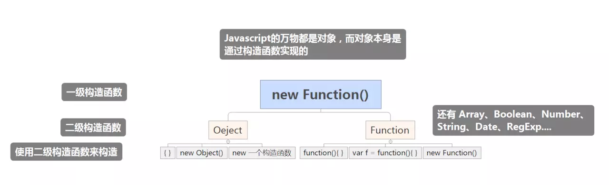

`javascript`原型
=================
javascript 分为`函数对象`和`普通对象`
```javascript
        typeof Object // 'function'
        typeof Function // 'function'
        typeof {} // 'object'
```
所有`Function`的实例都是`函数对象`,其他的都是`普通对象`, 用 `instanceof Function` 区分


进阶:`prototype` 和 `__proto__`
===================================
|对象类型|`prototype`|`__proto__`|
|:--:|:--:|:--:|
|普通对象|no|yes|
|函数对象|yes|yes|
```
prototype 被实例的 __proto__ 所指向（被动）  
__proto__ 指向构造函数的 prototype（主动）
```

* 函数对象的 __proto__ 指向 Function.prototype；（复习）  
* 函数对象的 prototype 指向 instance.__proto__；（复习）  
* 普通对象的 __proto__ 指向 Object.prototype；（复习）  
* 普通对象没有 prototype 属性；（复习）  
* 在访问一个对象的某个属性/方法时，若在当前对象上找不到，则会尝试访问 ob.__proto__, 也就是访问该对象的构造函数的原型 obCtr.prototype，若仍找不到，会继续查找 obCtr.prototype.__proto__，像依次查找下去。若在某一刻，找到了该属性，则会立刻返回值并停止对原型链的搜索，若找不到，则返回 undefined。

``` javascript
// 实际代码
function fn1() {}
// JavaScript 自动执行
fn1.protptype = {
    constructor: fn1,
    __proto__: Object.prototype
}
fn1.__proto__ = Function.prototype
```

1. 若 A 通过new创建了B,则 B.__proto__ = A.prototype；
2. __proto__是原型链查找的起点；
3. 执行B.a，若在B中找不到a，则会在B.__proto__中，也就是A.prototype中查找，若A.prototype中仍然没有，则会继续向上查找，最终，一定会找到Object.prototype,倘若还找不到，因为Object.prototype.__proto__指向null，因此会返回undefined；
为什么万物皆空，还是那句话，原型链的顶端，一定有Object.prototype.__proto__ ——> null。


